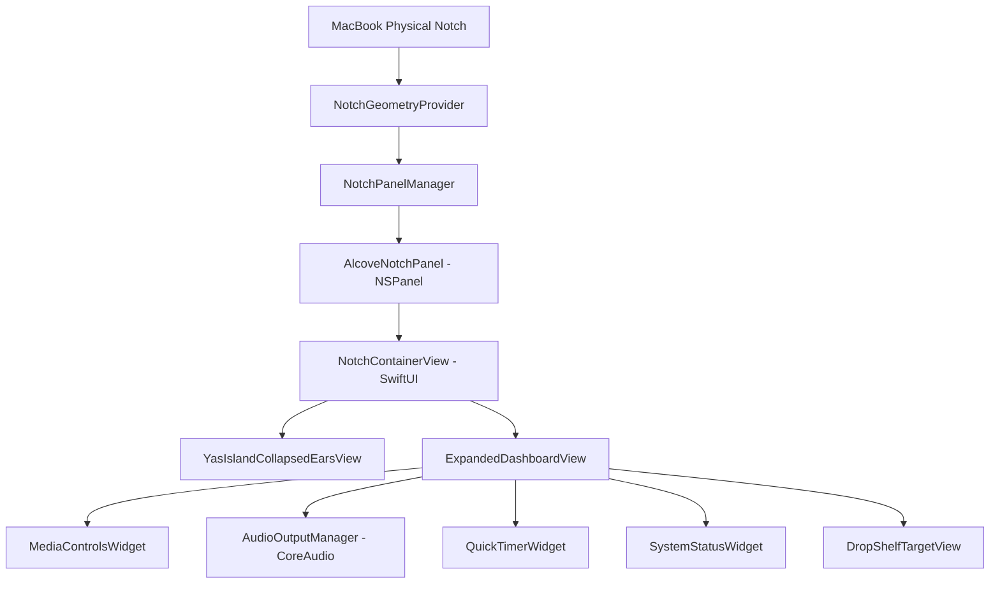

# 🏝️ Yas Island — Dynamic Notch HUD for macOS

[](https://apple.com/macos)
[](https://swift.org)
[](https://developer.apple.com/xcode/swiftui/)
[](https://developer.apple.com/documentation/coreaudio)
[](LICENSE)

> **Transforming the MacBook camera notch from dead black plastic into an organic, liquid Dynamic Island HUD.** Built natively with Swift 6, SwiftUI, AppKit (`NSPanel`), and Apple CoreAudio.

---

```
 ╭─────────────────────────────────────────────────────────────────────────────╮
 │ 🎵 Tame Impala - Loser (Official Video)                              ||||   │
 │   tameimpalaVEVO                                                            │
 │   3:23    [═════════════════════●─────────────]                      -1:03  │
 │                     ⏮          ⏸          ⏭                      🎧     │
 ╰─────────────────────────────────────────────────────────────────────────────╯
```

---

## 🌟 Key Innovations & Engineering Highlights

### 1. 🌊 $120\text{Hz}$ Hardware-Anchored Liquid Squircle Morphing
- **The Problem**: Traditional macOS overlay apps resize their `NSWindow` frames on hover, causing the macOS WindowServer to reallocate backing textures with noticeable frame stutter ($30\text{Hz}$ lag).
- **The Solution**: Yas Island employs a fixed transparent root canvas where the OLED black silhouette is morphed **$100\%$ within SwiftUI** using interpolating spring physics (`mass: 0.8, stiffness: 180, damping: 18`).
- **Dynamic Curvature**: The top edge remains clamped at $0\text{pt}$ corner radius flush against the screen bezel, while the bottom corners interpolate from $9.0\text{pt}$ (camera cutout) to $36.0\text{pt}$ (deep Apple capsule squircle) at native **$120\text{Hz}$ ProMotion**.

### 2. 🎵 Universal Multi-Source Media Engine
- **Tier 1 (System MediaRemote)**: Low-level binding to Apple’s private `MediaRemote.framework` for instant Control Center session sync.
- **Tier 2 (Native AppleScript Fallback)**: Process-guarded AppleScript queries to native Spotify and Apple Music processes.
- **Tier 3 (Browser Audio Scanner)**: Real-time tab scanner for **Brave Browser, Google Chrome, Safari, and Arc** that extracts live track metadata and automatically downloads high-res YouTube video thumbnails via `https://img.youtube.com/vi/<id>/hqdefault.jpg`.
- **Zero Modal Interruptions**: Pre-execution checks via `NSWorkspace.shared.runningApplications` eliminate macOS *"Where is Spotify?"* modal prompts.

### 3. 🎧 1-Click CoreAudio Hardware Routing
- Queries connected audio hardware via Apple's low-level **CoreAudio HAL** (`AudioObjectGetPropertyData`).
- Allows users to switch audio output between **MacBook Speakers**, **AirPods Pro**, **Bluetooth Headphones**, and **Display/HDMI Audio** with a single click.
- Real-time hardware volume slider and mute controls directly in the HUD.

### 4. ⚡️ Dual-Pane Split Screen (Duo Mode)
- Automatically splits into a side-by-side cockpit when multitasking:
  - **Left Pane**: Compact Media Controller with thumbnail, scrubber, and playback controls.
  - **Right Pane**: Interactive Live Activity Hub with **Pomodoro Focus Timer** (`5m`, `15m`, `25m`), **Apple Silicon Activity Telemetry** (CPU, RAM, Battery %), or **Drop Vault**.
- **Collapsed Twin Orbiting Capsules**: Left ear shows the song thumbnail and live equalizer waveform; right ear shows the orange timer countdown (`⏱ 24:18`).

---

## 🏗️ Architecture & Component Overview



### Module Breakdown:
| Directory | Responsibility |
| :--- | :--- |
| **`Core/NotchEngine/`** | `NSPanel` lifecycle, screen metrics resolution, collection behaviors, and geometry providers. |
| **`Core/Hardware/`** | Low-level CoreAudio hardware output device discovery, switching, and volume control. |
| **`Features/NotchUI/`** | SwiftUI morphing container, squircle masks, fluid spring curves, and audio waveform animations. |
| **`Features/Widgets/`** | Modular widgets: Media controls, Pomodoro timer, telemetry rings, drop vault, and AI workflows. |
| **`App/`** | `NSApplicationDelegate`, menu bar status item, and accessory policy lifecycle. |

---

## 🚀 Installation & Distribution

### 📦 Pre-Built App
1. Download **`Yas Island-v1.0.0.zip`** from [Releases](https://github.com/YashRajKeshri/YasIsland/releases).
2. Unzip and drag **`Yas Island.app`** into your `/Applications` folder.
3. Open the app and hover your cursor over the camera notch!

### 💻 Building from Source
```bash
# Clone repository
git clone https://github.com/YashRajKeshri/YasIsland.git
cd YasIsland

# Build optimized release binary and package .app bundle
./scripts/build_app.sh

# Install into /Applications
cp -R "Yas Island.app" /Applications/
open -a "/Applications/Yas Island.app"
```

---

## 🎮 Keyboard & Mouse Shortcuts

- **Hover over Camera Notch**: Expand island HUD.
- **Move Cursor Away / Press `Esc`**: Collapse island HUD.
- **Click Album Art**: Open active playlist in Spotify / Apple Music / Browser.
- **Click `🎧` Icon**: Switch audio output to AirPods or external speakers.
- **Click `[ ◫ ]` Icon**: Toggle between Single Focus and Dual Split Screen.

---

## 📄 License
This project is licensed under the **MIT License** — feel free to modify, distribute, and build upon it.
